```mermaid
%%{init: {'theme':'base', 'themeVariables': { 'primaryColor':'#e8f5e1','primaryTextColor':'#2d3f1f','primaryBorderColor':'#6A8035','lineColor':'#8CA846','secondaryColor':'#d4e7c5','tertiaryColor':'#f0f7eb'}}}%%
timeline
    title 🌱 Developer Journey: 2019 - 2026
    section 🌿 Early Days
        2019 : HTML Fundamentals
             : Web Development Basics
             : Grades 11-12
        2021 : ICCT Colleges
             : Systems & Hardware
             : IT Foundation
    section 🍃 Skill Building
        2022 : Software Development
             : Programming Fundamentals
        2023 : Cisco Networking
             : Infrastructure & Protocols
        2024 : Python Development
             : Backend Specialization
    section 🍵 Professional Era
        2025 : Advanced Web (Next.js)
             : JJC Engineering Intern
             : Promoted to Part-Time
             : Production Systems
        2026 : Full-Time Developer
             : Enterprise Architecture
             : Finance Hub Development
```

<div align="center">
  
  <!-- Pixel Art Header -->
  

  <br/>

  <!-- Animated Pixel Keith Avatar -->
  <a href="https://keithfbuilds.dev">
    
  </a>

  <br/><br/>

  <!-- Animated Typing Text -->
  <a href="https://git.io/typing-svg">
    
  </a>

  <br/>

  <!-- Social Badges with Pixel Style -->
  <p>
    <a href="https://keithfbuilds.dev" target="_blank">
      
    </a>
    <a href="mailto:Keithfelipe024@gmail.com">
      
    </a>
    <a href="https://www.linkedin.com/in/keith-wilhelm-felipe-a15610366">
      
    </a>
  </p>

  <br/>

  <!-- Pixel Divider -->
  

</div>

<br />

<!-- About Section with Pixel Terminal Style -->
<div align="center">
  
  
  
  <br/><br/>

  <table width="90%">
    <tr>
      <td width="50%" valign="top">
        
```
╔════════════════════════════════════╗
║  👨‍💻 DEVELOPER PROFILE            ║
╚════════════════════════════════════╝

▸ STATUS: Full-Time Developer
▸ COMPANY: JJC Engineering Works
▸ LOCATION: Antipolo, PH 🇵🇭
▸ TIMEZONE: GMT+8

╔════════════════════════════════════╗
║  📊 CAREER PROGRESSION            ║
╚════════════════════════════════════╝

2025.01 → Intern
2025.04 → Part-Time Developer (3mo)
2025.10 → Full-Time Developer (6mo+)
```

  </td>
      <td width="50%" valign="top">

```
╔════════════════════════════════════╗
║  🎯 MISSION STATEMENT             ║
╚════════════════════════════════════╝

Building production-grade enterprise
systems. Specializing in modernizing
legacy desktop applications into
scalable web platforms.

╔════════════════════════════════════╗
║  ⭐ KEY ACHIEVEMENT               ║
╚════════════════════════════════════╝

Developed JJC Toolbox - Enterprise
Inventory Platform serving 60+ users
with real-time POS & asset tracking.
```

  </td>
    </tr>
  </table>

</div>

<br />

<!-- Projects Section -->
<div align="center">
  
  
  
  <br/><br/>

  <table width="95%">
    <tr>
      <td width="25%" align="center" valign="top">
        <br/><br/>
        <samp><b>Inventory & POS Platform</b></samp><br/>
        <samp>Serving 60+ employees with real-time asset monitoring & transaction processing</samp><br/><br/>
        <br/>
        
      </td>
      <td width="25%" align="center" valign="top">
        <br/><br/>
        <samp><b>Supply Chain Hub</b></samp><br/>
        <samp>Centralized platform for Purchase Orders & Supplier management workflows</samp><br/><br/>
        <br/>
        
      </td>
      <td width="25%" align="center" valign="top">
        <br/><br/>
        <samp><b>Human Resources Portal</b></samp><br/>
        <samp>Redesigned employee data management with modern UI/UX principles</samp><br/><br/>
        <br/>
        
      </td>
      <td width="25%" align="center" valign="top">
        <br/><br/>
        <samp><b>Accounting Web App</b></samp><br/>
        <samp>Next-gen financial management system with automated reporting</samp><br/><br/>
        <br/>
        
      </td>
    </tr>
  </table>

</div>

<br />

<!-- Tech Stack Section -->
<div align="center">
  
  
  
  <br/><br/>

  <table width="90%">
    <tr>
      <td align="center">
        <br/><br/>
        <br/><br/>
        
        
        
      </td>
    </tr>
    <tr><td height="20"></td></tr>
    <tr>
      <td align="center">
        <br/><br/>
        <br/><br/>
        
        
        
      </td>
    </tr>
  </table>

</div>

<br />

<!-- Journey Timeline -->
<div align="center">
  
  
  
  <br/><br/>

</div>



<br />

<!-- Stats Section -->
<div align="center">
  
  
  
  <br/><br/>

  
  

  <br/><br/>

  

</div>

<br />

<!-- Activity Graph -->
<div align="center">
  
  
  
  <br/><br/>

  

</div>

<br />

<!-- Quote Section -->
<div align="center">
  
  

</div>

<br />

<!-- Footer -->
<div align="center">
  
  
  
  <br/>
  
  
  
  <br/><br/>
  
  <samp>Made with 💚 and ☕ by Keith Felipe</samp>
  
</div>
